# OpenPaddock — Piano di Sviluppo Completo

## 🏁 Visione
OpenPaddock è una piattaforma pubblica per appassionati di Formula 1 che unisce **news in tempo reale**, **live timing**, **telemetria dettagliata**, **statistiche storiche** e **mappe 3D interattive** dei circuiti in un'unica esperienza moderna.

---

## 🧱 Stack Tecnologico

| Tecnologia | Ruolo | Perché |
|------------|-------|--------|
| **Next.js 15** (App Router) | Frontend + API Routes | SSR/SSG per SEO, React Server Components per performance, API Routes per backend leggero senza server separato |
| **TypeScript** | Linguaggio | Type safety su tutto il codebase, autocompletamento, riduzione bug |
| **Supabase** | Auth + Profili utente | Auth gestita (OAuth, magic link, email), Row Level Security, trigger SQL, hosting cloud gratuito |
| **PocketBase** | CMS News + Contenuti | Self-hosted (Raspberry Pi), interfaccia admin integrata, API REST automatica, leggero (~15MB), perfetto per contenuti editoriali |
| **TimescaleDB** | Telemetria + Statistiche | Estensione PostgreSQL ottimizzata per serie temporali (hypertable), compressione automatica, query veloci su milioni di righe |
| **Drizzle ORM** | Accesso DB tipizzato | Type-safe, leggero, zero overhead, schema-as-code, migrazioni automatiche con `drizzle-kit push` |
| **Docker + Portainer** | Infrastruttura | Container isolati sul Raspberry Pi, gestione visuale via Portainer, facile backup e riavvio |
| **OpenF1 API** | Fonte dati F1 | API pubblica e gratuita, dati live e storici, nessuna chiave API richiesta |
| **Three.js / R3F** | Mappe 3D | Rendering 3D nel browser, React Three Fiber per integrazione nativa con React |
| **Recharts / D3.js** | Grafici statistiche | Recharts per grafici standard (facile), D3.js per visualizzazioni custom avanzate |
| **WebSocket** | Live Timing | Comunicazione bidirezionale in tempo reale per aggiornamenti posizioni e tempi durante la gara |
| **Redis** *(futuro)* | Cache | Cache aggressiva per dati live, riduce carico sul DB e sull'API OpenF1 |

---

## 🟢 MUST HAVE — Funzionalità Necessarie

### 1. Sistema di Autenticazione (Supabase)
**Cosa**: Login, registrazione, reset password, profilo utente con pilota/team preferito.

**Come svilupparlo**:
- ✅ *Già fatto*: Client Supabase configurato, pagine Login/Register/Reset funzionanti
- **Da fare**: Creare tabella `profiles` su Supabase con trigger `on_auth_user_created` che popola automaticamente il profilo
- **Da fare**: Pagina `/profile` per modificare nome, avatar, pilota e team preferito
- **Da fare**: Sistema ruoli (`user`/`admin`) per separare utenti normali da chi gestisce i contenuti

**Tecnologia**: Supabase Auth + Supabase Database (PostgreSQL cloud)
**Perché Supabase e non PocketBase per auth**: Supabase offre Row Level Security nativa, OAuth con Google/GitHub/Apple in un click, e non richiede self-hosting per un servizio critico come l'autenticazione.

---

### 2. News & Contenuti (PocketBase)
**Cosa**: Aggregazione automatica di news F1 da feed RSS, articoli originali scritti da admin, sistema di like/bookmark/commenti.

**Come svilupparlo**:
- **Da fare**: Migrare l'API `/api/news/update` da Supabase a PocketBase (attualmente salva su Supabase)
- **Da fare**: Creare collezioni `news`, `news_interactions`, `comments` su PocketBase
- **Da fare**: Pagina news con lista articoli, filtri, ricerca
- **Da fare**: Sistema commenti sotto ogni articolo (autenticazione via token Supabase → PocketBase)
- **Da fare**: Bottoni Like e Bookmark per ogni news

**Tecnologia**: PocketBase (self-hosted su Raspberry Pi)
**Perché PocketBase per i contenuti**: Ha un'interfaccia admin integrata (utile per scrivere articoli), è leggerissimo, e separandolo dall'auth non crea un single point of failure. Se il Pi va offline, l'auth (Supabase cloud) continua a funzionare.

---

### 3. Database Core F1 (TimescaleDB)
**Cosa**: Struttura dati completa della Formula 1: stagioni, circuiti, piloti, team, eventi, sessioni, risultati gara, classifiche.

**Come svilupparlo**:
- **Da fare**: Definire lo schema completo in `src/core/postgres/schema.ts` con Drizzle
- **Da fare**: Eseguire `npx drizzle-kit push` per creare le tabelle sul Raspberry Pi
- **Da fare**: Script di seed per popolare dati base (piloti 2024/2025, circuiti, team)
- **Da fare**: Script di importazione da OpenF1 API per risultati e giri

**Tabelle coinvolte**: `seasons`, `circuits`, `drivers`, `teams`, `events`, `sessions`, `laps`, `race_results`, `pit_stops`, `standings_drivers`, `standings_constructors`

**Tecnologia**: TimescaleDB + Drizzle ORM
**Perché TimescaleDB**: I dati F1 sono intrinsecamente temporali. TimescaleDB partiziona i dati per tempo automaticamente, rendendo le query storiche (es. "tutti i giri di Leclerc nel 2024") estremamente veloci anche con milioni di righe.

---

### 4. Pagine Statistiche
**Cosa**: Dashboard con classifiche piloti/costruttori, risultati per GP, confronto giri, andamento punti nella stagione.

**Come svilupparlo**:
- **Da fare**: Pagina `/standings` — Classifica Piloti e Costruttori (tabella interattiva)
- **Da fare**: Pagina `/races` — Lista GP della stagione con risultati
- **Da fare**: Pagina `/race/[id]` — Dettaglio singolo GP (griglia, risultato, pit stop, giro veloce)
- **Da fare**: Grafici andamento punti nel campionato (Recharts)

**Tecnologia**: Next.js Server Components + Drizzle + Recharts
**Perché Recharts**: Libreria React-native per grafici, facile da usare, responsive, ottima per line/bar chart. Per visualizzazioni più complesse (es. mappa calore frenate), useremo D3.js.

---

### 5. Integrazione OpenF1 API
**Cosa**: Script/servizio che scarica dati dalla API pubblica OpenF1 e li salva su TimescaleDB.

**Come svilupparlo**:
- **Da fare**: Modulo `src/core/openf1/client.ts` — Wrapper per le chiamate API
- **Da fare**: API Route `/api/f1/sync` — Endpoint protetto che avvia la sincronizzazione
- **Da fare**: Logica di importazione: Session → Laps → Results → Standings
- **Da fare**: Cron job (Vercel Cron o manuale) per aggiornare periodicamente

**Tecnologia**: Next.js API Routes + fetch + Drizzle
**Perché non un server Python separato**: Tenere tutto nel progetto Next.js semplifica il deployment e riduce la complessità. OpenF1 API è REST, non servono librerie Python specifiche.

---

## 🟡 NICE TO HAVE — Funzionalità Future

### 6. Live Timing (Tempo Reale)
**Cosa**: Pagina che mostra posizioni, distacchi, pit stop e bandiere in tempo reale durante una sessione.

**Come svilupparlo**:
- Servizio che poll OpenF1 API ogni 2-5 secondi durante una sessione live
- WebSocket server per spingere updates ai client connessi
- UI con tabella posizioni aggiornabile in tempo reale
- Redis come buffer tra l'API e i client per non sovraccaricare il DB

**Tecnologia**: WebSocket (Socket.io o native WS) + Redis + React state management
**Perché WebSocket**: HTTP polling causa latenza e spreco di banda. WebSocket mantiene una connessione persistente → aggiornamenti istantanei.
**Perché Redis**: Cache in-memory che regge migliaia di letture/secondo. Perfetto come buffer tra OpenF1 e i client.

---

### 7. Telemetria Raw (Hypertable)
**Cosa**: Dati campionati ogni ~100ms: velocità, RPM, throttle, brake, marcia, DRS, posizione GPS per ogni pilota.

**Come svilupparlo**:
- Hypertable TimescaleDB per partizionamento automatico
- Script di importazione bulk per sessioni storiche (su richiesta utente)
- Grafici real-time per sessioni live
- Confronto telemetria tra 2 piloti sullo stesso giro

**Tecnologia**: TimescaleDB Hypertable + D3.js
**Perché Hypertable**: Una sessione genera ~500k righe di telemetria. Le hypertable comprimono e partizionano automaticamente, rendendo le query veloci anche su miliardi di righe storiche.

---

### 8. Mappe 3D Interattive dei Circuiti
**Cosa**: Visualizzazione 3D del tracciato con posizioni dei piloti in tempo reale, settori colorati, zone DRS.

**Come svilupparlo**:
- Dati coordinate tracciato da OpenF1 (`location` endpoint)
- Rendering 3D con Three.js / React Three Fiber
- Posizioni piloti come marker animati sulla mappa
- Camera controllabile dall'utente (zoom, rotazione, follow driver)
- Tabella `circuit_track_points` per i dati 3D del tracciato

**Tecnologia**: React Three Fiber + Three.js
**Perché R3F**: È il ponte perfetto tra React e Three.js. Componenti dichiarativi, stato React per animazioni, performance native WebGL. Alternativa (Mapbox/Leaflet) non supporta vere mappe 3D.

---

### 9. Confronto Piloti
**Cosa**: Pagina dove l'utente seleziona 2 piloti e un giro specifico, e vede grafici sovrapposti di velocità, frenata, throttle.

**Come svilupparlo**:
- Selettore UI per scegliere sessione, giro, e 2 piloti
- Query telemetria per entrambi i piloti
- Grafico D3.js con 2 linee sovrapposte (una per pilota)
- Sincronizzazione per distanza percorsa (non per tempo) per confronto corretto

**Tecnologia**: D3.js + Drizzle
**Perché D3.js e non Recharts**: Recharts è limitato per grafici con 2000+ punti sincronizzati. D3 permette rendering SVG/Canvas custom con performance adeguate.

---

### 10. Dashboard Personalizzabile
**Cosa**: L'utente sceglie quali widget vedere (classifica, prossimo GP, news, stats pilota preferito).

**Come svilupparlo**:
- Tabella `dashboard_preferences` su Supabase (JSON layout)
- Componenti widget modulari (drag & drop futuro)
- Default intelligente basato su pilota/team preferito

**Tecnologia**: Supabase + React DnD
**Perché JSON layout**: Flessibile, non richiede tabelle aggiuntive. Il layout è un oggetto JSON salvato nel profilo utente.

---

### 11. Alert Pilota & Notifiche
**Cosa**: L'utente riceve notifiche push quando il suo pilota preferito fa un sorpasso, un pit stop, o è coinvolto in un incidente.

**Come svilupparlo**:
- Tabella `user_driver_alerts` su Supabase
- Service Worker per notifiche push nel browser
- Integrazione con il sistema Live Timing

**Tecnologia**: Web Push API + Service Worker
**Perché Web Push**: Nativo nel browser, non richiede app mobile. Supportato da Chrome, Firefox, Edge, Safari.

---

## 📅 Fasi di Sviluppo

```mermaid
gantt
    title OpenPaddock — Roadmap
    dateFormat  YYYY-MM-DD
    section Must Have
    Auth Profiles + Trigger         :a1, 2026-02-18, 3d
    Migrazione News a PocketBase    :a2, after a1, 5d
    Schema DB Core F1 (Drizzle)     :a3, after a1, 5d
    Import Dati OpenF1 API          :a4, after a3, 7d
    Pagine Statistiche              :a5, after a4, 7d
    section Nice to Have
    Live Timing (WebSocket + Redis) :b1, after a5, 14d
    Telemetria Raw (Hypertable)     :b2, after b1, 10d
    Mappe 3D Circuiti               :b3, after b2, 14d
    Confronto Piloti                :b4, after b2, 7d
    Dashboard Personalizzabile      :b5, after b3, 7d
    Notifiche Push                  :b6, after b5, 5d
```



---

## 🗂️ Struttura Cartelle del Progetto

```
src/
├── app/                        # Pagine Next.js (App Router)
│   ├── (auth)/                 # Pagine guest: login, register, reset
│   ├── homePage/               # Home loggata (news feed)
│   ├── standings/              # Classifiche piloti/costruttori
│   ├── races/                  # Lista GP + dettaglio singolo GP
│   ├── live/                   # Live Timing (futuro)
│   ├── telemetry/              # Confronto telemetria (futuro)
│   ├── profile/                # Profilo utente
│   └── api/                    # API Routes
│       ├── db-check/           # Test connessione DB
│       ├── news/update/        # Sincronizzazione RSS → PocketBase
│       └── f1/sync/            # Sincronizzazione OpenF1 → TimescaleDB
├── core/                       # Logica di business
│   ├── supabase/               # Client + Auth
│   ├── pocketbase/             # Client + Connection
│   ├── postgres/               # Drizzle Client + Schema
│   └── openf1/                 # Wrapper API OpenF1
├── components/                 # Componenti UI riusabili
│   ├── header.tsx
│   ├── charts/                 # Componenti grafici
│   └── 3d/                     # Componenti Three.js (futuro)
└── middleware.ts                # Protezione rotte
```

---

## 🔒 Sicurezza

| Area | Strategia |
|------|-----------|
| Auth | Supabase gestisce hashing, JWT, refresh token |
| API Routes | Protette con `CRON_SECRET_KEY` per endpoint di sync |
| Database | Row Level Security su Supabase, firewall locale per TimescaleDB |
| PocketBase | API rules per collezione (solo lettura pubblica, scrittura admin) |
| Env vars | Mai committate su Git (`.env.local` in `.gitignore`) |
